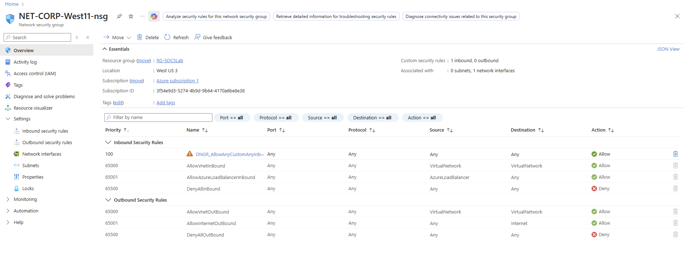
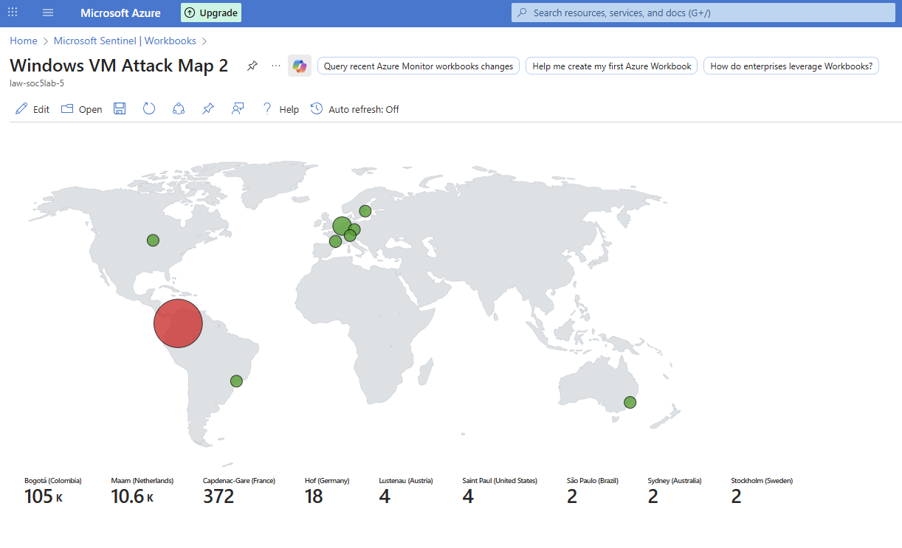

# 🍯 Azure Honeypot — Real-World Brute-Force Attack Detection with Microsoft Sentinel


---

## 📌 Project Summary / Introduction

This project demonstrates a real-world honeypot deployment on Microsoft Azure designed to attract, capture, and analyze brute-force login activity from across the globe. By intentionally exposing a Windows 11 Virtual Machine to the public internet — with all firewall protections disabled and inbound traffic fully open — the experiment simulates an unsecured system to observe how quickly and aggressively threat actors discover and target exposed endpoints.

Within approximately **20 hours** of deployment, the honeypot logged over **35,000 failed logon attempts** originating from multiple countries. The collected data was analyzed using **Microsoft Sentinel** as the SIEM platform and **KQL (Kusto Query Language)** for log queries, enriched with geolocation data, and visualized through a custom **Azure Workbook attack map**.

This project simulates a core SOC (Security Operations Center) analyst workflow: log ingestion → threat detection → investigation → visualization.

---

## 🗂️ Project Overview

| Detail | Value |
|---|---|
| **Cloud Platform** | Microsoft Azure |
| **VM OS** | Windows 11 |
| **Region** | West US 3 |
| **Resource Group** | RG-SOC5Lab |
| **SIEM** | Microsoft Sentinel |
| **Log Workspace** | LAW-SOC5Lab-5 |
| **Observation Window** | ~20 hours |
| **Total Failed Logon Attempts** | 35,000+ |

The core idea behind this project is simple: expose a machine, watch who attacks it, and build the tooling to detect, log, and visualize that activity — exactly what a real SOC team does at scale.

---

## 🛠️ Technologies Used

| Technology | Purpose |
|---|---|
| **Microsoft Azure** | Cloud infrastructure hosting |
| **Windows 11 Virtual Machine** | Honeypot endpoint (NET-CORP-West11) |
| **Azure Virtual Network (VNet)** | Networking layer (VNet-SOC5Lab5) |
| **Network Security Group (NSG)** | Configured to allow all inbound traffic |
| **Azure Public IP** | Exposed the VM to the public internet |
| **Log Analytics Workspace** | Centralized log collection and querying |
| **Microsoft Sentinel** | SIEM — detection rules, incidents, workbooks |
| **Windows Security Events via AMA** | Data connector for Windows event log ingestion |
| **Data Collection Rule (DCR)** | DCR6-windows-sec6 — routes logs to workspace |
| **KQL (Kusto Query Language)** | Log analysis and geolocation enrichment queries |
| **Azure Workbook** | Custom interactive attack map visualization |
| **GeoIP Watchlist** | IP-to-location enrichment dataset |

---

## ⚙️ Setup Steps

### Step 1 — Create a Windows 11 Virtual Machine and Virtual Network

A Windows 11 VM (`NET-CORP-West11`) was provisioned in Azure under the resource group `RG-SOC5Lab` in the **West US 3** region. A virtual network (`VNet-SOC5Lab5`) and a public IP address (`NET-CORP-West11-ip`) were created and associated with the VM's network interface (`net-corp-west11592_z1`), making the machine directly reachable from the internet.

### Step 2 — Create a Permissive NSG Rule to Attract Attackers

A custom inbound security rule (`DNGR_AllowAnyCustomAnyInbound`) was added to the Network Security Group (`NET-CORP-West11-nsg`) with the following configuration:

- **Priority:** 100 (evaluated first, before all other rules)
- **Source:** Any
- **Destination:** Any
- **Port:** Any
- **Protocol:** Any
- **Action:** Allow ✅

This rule overrides the default `DenyAllInBound` rule, effectively opening every port on the machine to all traffic from the internet — mimicking a severely misconfigured system.



### Step 3 — Disable the Windows Firewall on the VM

After RDP-ing into the VM, the built-in Windows Defender Firewall was completely turned off for all network profiles (Domain, Private, Public). This ensures that inbound traffic is not blocked at the OS level and that authentication attempts reach the Windows Security Event log.

### Step 4 — Configure the Windows Security Events Connector and Log Analytics Workspace

A **Log Analytics Workspace** (`LAW-SOC5Lab-5`) was created and linked to **Microsoft Sentinel**. The **"Windows Security Events via AMA"** data connector was enabled, and a **Data Collection Rule** (`DCR6-windows-sec6`) was configured to stream Windows Security Events from the VM into the workspace. This enables real-time log querying and SIEM-based detection.

> **Windows Security Event ID 4625** — "An account failed to log on" — was the primary event type monitored throughout this experiment.

### Step 5 — Build an Attack Map via Log Enrichment and Geolocation

A **GeoIP watchlist** (named `geoip`) was uploaded into Microsoft Sentinel, containing a mapping of IP address ranges to city, country, latitude, and longitude data.

Using KQL, Windows Security Event logs were enriched with geolocation information by joining failed logon events against the GeoIP watchlist. The enriched data was then used to build a custom **Azure Workbook** (`Windows VM Attack Map 2`) that renders attacker IPs as geographically plotted markers on a world map.



---

## 🔍 KQL Queries

### Query 1 — Geo-Enriched Failed Logon Events (Used for the Attack Map)

This is the core query used to power the attack map workbook. It retrieves all failed logon events (Event ID 4625), enriches each attacker IP with geolocation data from the GeoIP watchlist, and projects the relevant fields.

```kql
let GeoIPDB_FULL = _GetWatchlist("geoip");
let WindowsEvents = SecurityEvent
    | where EventID == 4625
    | order by TimeGenerated desc
    | evaluate ipv4_lookup(GeoIPDB_FULL, IpAddress, network);
WindowsEvents
| project TimeGenerated, Computer, AttackerIp = IpAddress, cityname, countryname, latitude, longitude
```

**What each part does:**
- `_GetWatchlist("geoip")` — loads the uploaded GeoIP watchlist containing IP-to-location mappings
- `EventID == 4625` — filters for failed logon attempts only
- `ipv4_lookup(...)` — enriches each attacker IP with matching geolocation data
- `project` — outputs only the relevant columns: timestamp, machine name, attacker IP, city, country, and coordinates

**Sample Output:**

| TimeGenerated (UTC) | Computer | AttackerIp | cityname | countryname | latitude | longitude |
|---|---|---|---|---|---|---|
| 12/17/2025, 3:41:47 AM | NET-CORP-West11 | 186.67.199.2 | Bogotá | Colombia | 4.6115 | -74.0833 |
| 12/17/2025, 3:41:47 AM | NET-CORP-West11 | 186.67.199.2 | Bogotá | Colombia | 4.6115 | -74.0833 |

---

### Query 2 — Count of Failed Logons per Attacker IP (Optional — For Threat Triage)

This query is useful for identifying the most aggressive source IPs:

```kql
SecurityEvent
| where EventID == 4625
| summarize FailedAttempts = count() by IpAddress
| order by FailedAttempts desc
```

---

## 📊 Results — Top Attack Locations

After approximately **20 hours** of the honeypot being live, the attack map revealed the following top attacker geolocations:

| Rank | Location | Failed Attempts |
|---|---|---|
| 🥇 1 | Bogotá, Colombia | 105,000+ |
| 🥈 2 | Maarn, Netherlands | 10,600+ |
| 🥉 3 | Capdenac-Gare, France | 372 |
| 4 | Hof, Germany | 18 |
| 5 | Lustenau, Austria | 4 |
| 6 | Saint Paul, United States | 4 |
| 7 | São Paulo, Brazil | 2 |
| 8 | Sydney, Australia | 2 |
| 9 | Stockholm, Sweden | 2 |

> **Key finding:** A single IP cluster from Bogotá, Colombia was responsible for the overwhelming majority of all attack traffic — over 105,000 failed logon attempts, likely from an automated botnet or credential-stuffing tool.

---

## 🧱 Azure Resources Deployed

The following resources were part of the `RG-SOC5Lab` resource group (Location: West US 3):

| Resource Name | Type |
|---|---|
| `36464e59-7f54-43e4-b68b-...` (Windows VM Attack Map 2) | Azure Workbook |
| `DCR6-windows-sec6` | Data Collection Rule |
| `LAW-SOC5Lab-5` | Log Analytics Workspace |
| `NET-CORP-West11` | Virtual Machine |
| `NET-CORP-West11-ip` | Public IP Address |
| `NET-CORP-West11-nsg` | Network Security Group |
| `net-corp-west11592_z1` | Network Interface |
| `NET-CORP-West11_OsDisk_1_...` | Disk |
| `SecurityInsights(law-soc5lab-5)` | Solution (Sentinel) |
| `VNet-SOC5Lab5` | Virtual Network |

---

## 🎓 Learning Outcomes

This project delivered hands-on experience across several key cybersecurity and cloud domains:

**Threat Detection & SIEM**
Gained practical experience configuring Microsoft Sentinel from scratch, including connecting data sources, writing detection rules, and investigating confirmed incidents — mirroring real SOC analyst workflows.

**KQL Log Analysis**
Developed proficiency writing Kusto Query Language queries to filter, aggregate, and enrich security event data. The `ipv4_lookup` + watchlist pattern is a production-grade technique used in enterprise threat hunting.

**Attacker Behavior & Exposure Risk**
Observed firsthand how rapidly an internet-exposed system is discovered and targeted — attack activity began within minutes of deployment. This reinforces the critical importance of defense-in-depth: NSG rules, host firewalls, and strong authentication are not optional.

**Geolocation & Log Enrichment**
Learned how to enrich raw log data with external datasets (GeoIP watchlists) to add operational context, transforming raw IPs into actionable threat intelligence.

**Visualization for SOC Teams**
Built an interactive Azure Workbook attack map, demonstrating how geospatial visualization helps SOC teams quickly understand attack origin patterns and prioritize investigation.

**Cloud Security Architecture**
Gained practical understanding of Azure networking components — VNets, NSGs, public IPs, NICs — and how misconfigurations at any layer can dramatically increase the attack surface.

---

## 📚 Reference

- **Microsoft Sentinel Documentation:** [https://learn.microsoft.com/en-us/azure/sentinel/](https://learn.microsoft.com/en-us/azure/sentinel/)
- **Windows Security Event ID 4625:** [https://learn.microsoft.com/en-us/windows/security/threat-protection/auditing/event-4625](https://learn.microsoft.com/en-us/windows/security/threat-protection/auditing/event-4625)
- **KQL (Kusto Query Language) Reference:** [https://learn.microsoft.com/en-us/azure/data-explorer/kusto/query/](https://learn.microsoft.com/en-us/azure/data-explorer/kusto/query/)
- **Azure Network Security Groups:** [https://learn.microsoft.com/en-us/azure/virtual-network/network-security-groups-overview](https://learn.microsoft.com/en-us/azure/virtual-network/network-security-groups-overview)
- **Special thanks to [Josh Madakor](https://www.youtube.com/@JoshMadakor)** for consistently sharing practical, real-world security learning content.

---

## 📁 Repository Structure

```
azure-honeypot/
├── README.md                        # This file
├── screenshots/
│   ├── Attack_map.png               # Azure Workbook attack map
│   ├── KQL_Queries_with_result.png  # KQL query and results in Sentinel Logs
│   ├── NSG_rule.png                 # Network Security Group inbound rule
│   └── Resource_Group.png           # Full list of Azure resources deployed
```

---

> **Disclaimer:** This honeypot was deployed in a controlled lab environment for educational purposes only. All resources were decommissioned after the experiment concluded. Do not replicate this setup in a production environment.
